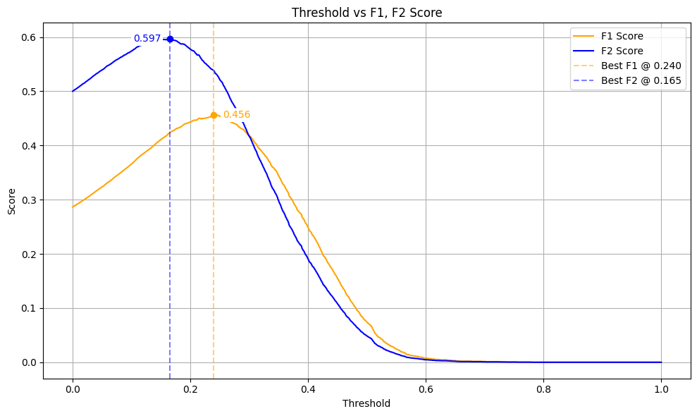
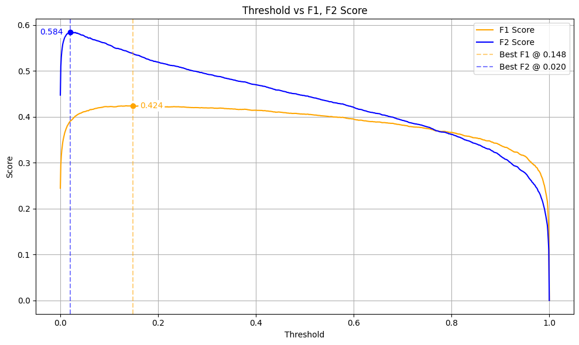
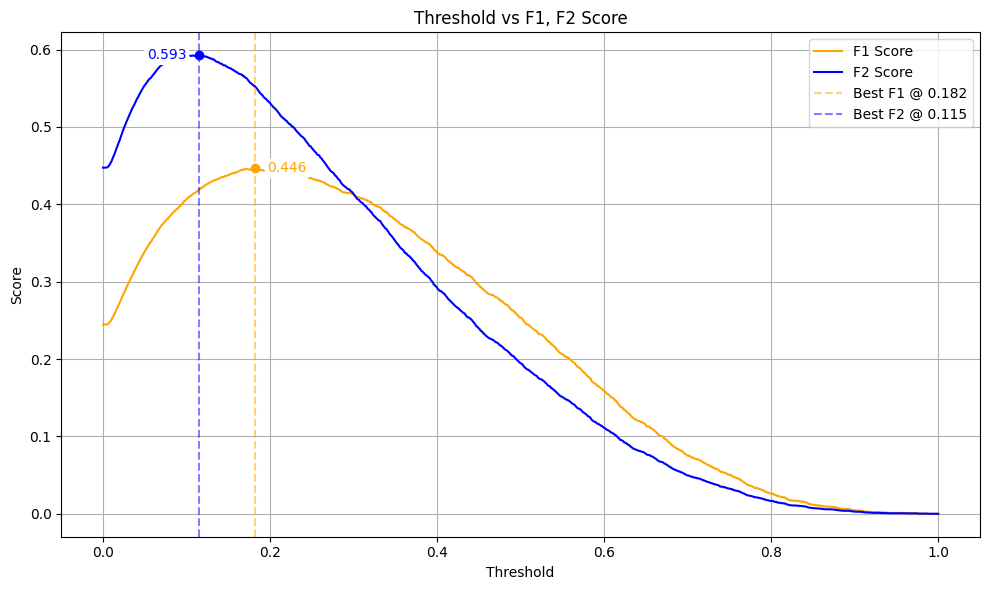

# Introduction
Diabetes is a common chronic metabolic disease whose early-stage symptoms are often subtle, yet it can lead to severe complications if left untreated. Early detection and timely intervention not only help improve individual quality of life but also effectively reduce overall healthcare expenditures and resource burdens. Current diagnostic practices primarily rely on fasting blood glucose and glycated hemoglobin (HbA1c) tests. However, these blood-based examinations present practical challenges in terms of cost, convenience, and accessibility, particularly in resource-limited settings.

Therefore, developing diabetes risk prediction models based on simple, non-invasive health indicators or questionnaire-based data holds substantial value for public health screening and policy applications. This study aims to construct machine learning–based risk prediction models to support early screening and informed health decision-making.

The dataset used in this study is obtained from the U.S. Centers for Disease Control and Prevention (CDC), specifically from the 2015 Behavioral Risk Factor Surveillance System (BRFSS). The BRFSS is a nationwide telephone survey that collects adult health-related information across the United States. The dataset consists of 253,680 observations and 22 variables, covering individual health conditions, lifestyle behaviors, and socioeconomic characteristics.

The target variable is a binary indicator, denoted as Diabetes_binary, which represents whether an individual has been diagnosed with diabetes by a physician and is formulated as a binary classification problem. Among the 22 variables, 14 are binary features (e.g., HighBP, Smoker, PhysActivity), while the remaining variables are continuous in nature (e.g., BMI and Age.)

This study focuses on exploring the applicability of machine learning methods in the public health domain and aims to develop a diabetes risk self-assessment model that can be utilized by the general population, thereby increasing the likelihood of early detection and intervention.

# Methodology
## Data Preprocessing

The dataset contains no missing values. Although duplicate observations may exist due to individuals sharing identical characteristics such as age and health status, these records correspond to different individuals and are therefore retained.

Exploratory data analysis (EDA) indicates that no pairwise correlation between features exceeds $0.6$. Given that the dataset consists primarily of categorical variables and exhibits limited feature complexity, all available variables are retained as model features.

To improve model performance and stability, a series of data preprocessing procedures is conducted prior to model training. First, stratified sampling is applied based on the binary diabetes target variable to preserve class proportions. The dataset is split into a training set 60%, a validation set 20%, and a test set 20%.

Feature standardization is then performed. As the dataset contains both binary categorical variables and continuous numerical variables, standardization is applied only to numerical features, while categorical variables are left unchanged. Numerical features are transformed using $Z$-score normalization, where the mean and standard deviation are computed from the training set. Each numerical feature is scaled to follow a distribution with mean 0 and standard deviation 1, and the same scaling parameters are subsequently applied to the validation and test sets to prevent data leakage.

## Model Descriptions
### 1. Least Squares Method

This study first applies the Ordinary Least Squares (OLS) method to construct a linear model for estimating an individual’s probability of developing diabetes, which is subsequently used for classification. Model parameters are obtained by solving the closed-form solution using the training data, given by:

$$
\begin{aligned}
\hat{\boldsymbol{\theta}}
&= \left( \mathbf{X}^\top \mathbf{X} \right)^{-1} \mathbf{X}^\top \mathbf{y}
\end{aligned}
$$

where $\mathbf{X}$ denotes the standardized feature matrix and $\mathbf{y}$ represents the corresponding target variable. The model produces a continuous output score, which reflects the individual’s degree of inclination toward the positive class ($y = 1$, indicating the presence of diabetes).
To enhance the model’s ability to identify individuals at high risk of diabetes, this study places particular emphasis on recall as the primary evaluation criterion. In public health applications, failing to identify high-risk individuals (i.e., false negatives) may delay timely medical intervention and lead to increased healthcare and societal costs. Consequently, improving recall is considered more critical than minimizing false positives in this context.

Accordingly, we adopt the $F_\beta$-score as the basis for classification threshold selection, setting $\beta = 2$ to assign greater weight to recall while still accounting for precision. The $F_\beta$-score is defined as:

$$
\begin{aligned}
\text{Precision}
&= \frac{TP}{TP + FP}
\end{aligned}
$$

$$
\begin{aligned}
\text{Recall}
&= \frac{TP}{TP + FN}
\end{aligned}
$$

$$
\begin{aligned}
F_\beta
&= (1 + \beta^2)\cdot
\frac{\text{Precision} \cdot \text{Recall}}
{\beta^2 \cdot \text{Precision} + \text{Recall}}
\end{aligned}
$$

Using the validation set, we evaluate model performance across different classification thresholds and select the threshold that maximizes the $F_2$-score. This optimal threshold is then applied to the test set to conduct final performance evaluation and confusion matrix analysis.

### 2. Naïve Bayes Classifier
As the second predictive model constructed in this study, we implement a Naïve Bayes classifier to model diabetes risk within a probabilistic inference framework. The task is formulated as a binary classification problem, and different likelihood functions are specified according to the data type of each feature.

The Naïve Bayes model is based on the conditional independence assumption, which assumes that features are independent given the class label $y$. Under this assumption, the joint probability of an observation $x$ belonging to class $y$ can be factorized and used for classification via maximum a posteriori (MAP) estimation, defined as:

$$
\begin{aligned}
\hat{y} = \arg\max_{y} P(y \mid x)
= \arg\max_{y} \frac{P(x \mid y)P(y)}{P(x)}
\propto P(x \mid y)\cdot P(y)
\end{aligned}
$$

Here, $P(y)$ denotes the prior probability of class $y$, and $P(x \mid y)$ represents the class-conditional likelihood of the observed features $x$. Since $P(x)$ is constant across all classes, it can be omitted during optimization.

To accommodate both continuous and binary predictors, the likelihood function is specified separately according to feature type.

 

#### (i.) Continuous Features (Gaussian Distribution)

For numerical features, we assume that each feature $x_i$ follows a normal (Gaussian) distribution conditioned on the class label $y$. The likelihood function is given by:

$$
\begin{aligned}
P(x_i \mid y)
&= \frac{1}{\sqrt{2\pi\sigma_{iy}^2}}
\exp\left(
-\frac{(x_i - \mu_{iy})^2}{2\sigma_{iy}^2}
\right)
\end{aligned}
$$

where $\mu_{iy}$ and $\sigma_{iy}^2$ denote the class-specific mean and variance of feature $x_i$, respectively.

 

#### (ii.) Binary Features (Bernoulli Distribution)
For binary features, a Bernoulli distribution is employed. The likelihood is defined as:

$$
\begin{aligned}
P(x_j \mid y)
&= p_{jy}^{x_j}
(1 - p_{jy})^{1 - x_j}
\end{aligned}
$$
where $p_{jy}$ represents the probability that feature $x_j = 1$ under class $y$.

To avoid numerical underflow, the log-likelihood is computed by summing over all features:

$$
\begin{aligned}
\log P(\mathbf{x} \mid y) = \sum_{i \in \text{numeric}} \log P(x_i \mid y) + \sum_{j \in \text{binary}} \log P(x_j \mid y)
\end{aligned}
$$

The final discriminant function combines the log-likelihood with the log prior:
$$
\begin{aligned}
\hat{y} = \arg\max_{y} \left[ \log P(y) + \log P(\mathbf{x} \mid y) \right]
\end{aligned}
$$

Consistent with the procedure adopted for the linear models, we further adjust the classification threshold on the posterior probability output by the Naïve Bayes classifier. The optimal threshold is selected using the validation set to maximize the $F_2$-score, placing greater emphasis on recall. During inference, the model outputs the estimated probability $P(y=1 \mid x)$, and classification is performed based on the selected optimal cutoff.

### 3. Logistic Regression with Gradient Descent

This study further implements a logistic regression model optimized via gradient descent, serving as a probabilistic classification method with strong interpretability and generalization capability. The model is trained by minimizing the binary cross-entropy loss, which is equivalent to the negative log-likelihood function, defined as:

$$
\begin{aligned}
\mathcal{L}(w, b)
&= -\frac{1}{n}
\sum_{i=1}^{n}
\Big[y_i \log(\hat{p}_i)+ (1 - y_i)\log(1 - \hat{p}_i)
\Big] ,\\
\hat{p}_i = \sigma\left( x_i^\top w + b \right)
\end{aligned}
$$

where $w$ denotes the weight vector, $b$ is the bias term, and $\hat{p}_i$ represents the predicted probability that observation $i$ belongs to the positive class.

The function $\sigma(\cdot)$ denotes the sigmoid activation function, which maps a linear combination of features to a probability:

$$
\begin{aligned}
\sigma(z) = \frac{1}{1 + e^{-z}}
\end{aligned}
$$

Model parameters are updated using batch gradient descent, where both $w$ and $b$ are iteratively optimized. Based on empirical tuning, the learning rate is set to 0.01, and the maximum number of training iterations is capped at 10,000.

To prevent overfitting and improve training efficiency, an early stopping mechanism is employed during model training. Training is terminated if the change in validation loss remains below 0.0001 for 100 consecutive epochs, indicating convergence. The parameter set that achieves the lowest validation loss is retained. Throughout training, loss values are recorded, and both training and validation loss curves are plotted to assess convergence behavior and potential overfitting.

During the evaluation stage, the model outputs a predicted probability $\hat{p}_i = P(y_i = 1 \mid x_i)$ for each observation. Using the validation set, different classification thresholds are examined to identify the optimal cutoff.

Consistent with the evaluation strategy adopted for other models, the $F_2$-score is used as the primary performance metric. The classification threshold is selected to maximize the $F_2$-score, thereby emphasizing recall in scenarios where identifying high-risk individuals is of greater importance than minimizing false positives.

### 4. Re-modeling with Undersampling

To examine the impact of class imbalance on model performance, we design an alternative training pipeline based on random undersampling. Specifically, both the training set and the validation set are independently undersampled at a ratio of 1:1, where negative-class observations are randomly retained to match the number of positive-class samples, resulting in balanced datasets.

 

Following undersampling, feature standardization is performed using $Z$-score normalization. The standardization procedure remains identical to that used in the original pipeline, with scaling parameters estimated from the undersampled training set and subsequently applied to the validation and test sets.

After undersampling, the logistic regression model is retrained using the balanced data. The same threshold search and performance evaluation procedures described previously are repeated to ensure a fair comparison. This setup allows us to explicitly assess how class balancing affects recall and precision under identical model specifications.

Finally, model performance is compared between the undersampled and non-undersampled settings on the test set. The comparison focuses on the $F_2$-score and the confusion matrix, providing practical insights into trade-offs between sensitivity and specificity under different class distribution assumptions.

### 5. Other Methods

To further enhance model performance and interpretability, this study also explored alternative data preprocessing and dimensionality reduction techniques, including principal component analysis (PCA) and linear discriminant analysis (LDA). These methods were considered with the objective of simplifying the feature space and reducing model complexity.

However, in the present dataset, the original variables exhibit sufficient discriminative power. Empirical results indicate that dimensionality reduction leads to partial information loss, which in turn degrades classification performance. Consequently, PCA and LDA are not incorporated into the primary analytical pipeline.

In addition, a linear regression model optimized via Gradient Descent was also implemented as a binary classification approach. Nevertheless, its predictive performance was consistently inferior to that of logistic regression, and therefore it was not retained as a principal linear model in the final analysis.

Overall, model selection in this study prioritizes predictive performance, interpretability, and training stability. After evaluating multiple modeling strategies, three approaches demonstrating the most stable performance and the greatest applicability to public health contexts are retained for in-depth discussion.

# Results and Discussion
| Metric | Least Square | Naïve Bayes | Logistic GD | Undersample Logistic GD |
|------|-------------|------------|-------------|-------------------------|
| TN | 27,844 | 25,230 | 28,918 | 16,686 |
| FP | 15,824 | 18,438 | 14,748 | 26,982 |
| TP | 5,965 | 6,119 | 5,783 | 6,814 |
| FN | 1,105 | 951 | 1,286 | 256 |
| Precision | 0.274 | 0.249 | 0.282 | 0.202 |
| Recall | 0.844 | 0.865 | 0.818 | 0.964 |
| $F_2$ score | 0.596 | 0.579 | 0.593 | 0.549 |

Table above summarizes the predictive performance of each model on the test set, allowing for a detailed comparison of trade-offs among precision, recall, and the $F_2$-score.

First, although the Least Squares model is inherently a regression-based approach, its predictions can be converted into a classification output through threshold adjustment. As a result, the model demonstrates meaningful performance in the classification task. On the test set, it achieves a recall of 0.844, indicating effective identification of most individuals with diabetes. At the same time, its precision is 0.274, and it attains the highest $F_2$-score among all models at 0.596. Despite its relatively simple predictive structure, the Least Squares model achieves a favorable balance between recall and precision, making it well suited for early-stage screening applications.

Next, the Naïve Bayes model, which assumes conditional independence among features and accommodates both continuous and binary variables, achieves the highest recall of all models at 0.865. This result highlights its strong tendency to identify positive (diabetes) cases. However, its precision is only 0.249, reflecting a substantial number of false positives, with a total of 18,438 false positive predictions. This behavior suggests that the model is prone to overpredicting the positive class, potentially leading to unnecessary medical examinations and increased healthcare costs. Its overall $F_2$-score is 0.579, lower than that of the Least Squares and logistic gradient descent models, indicating a trade-off incurred by prioritizing recall.

The logistic regression model trained via gradient descent achieves a precision of 0.282 and a recall of 0.818 on the test set, representing the highest precision among the four models. Although its recall ranks third, the model maintains a relatively stable balance between precision and recall, resulting in an $F_2$-score of 0.593. This performance suggests that logistic regression offers a robust compromise between false positives and false negatives, making it suitable for applications where both misdiagnosis and missed diagnosis risks must be considered. The model also demonstrates strong generalization capability.

Finally, the undersampled logistic regression model, in which the class ratio in the training and validation sets is adjusted to 1:1, achieves a substantial increase in recall to 0.964, successfully identifying nearly all individuals with diabetes, with only 256 false negatives remaining. This result demonstrates exceptional sensitivity to the positive class. However, this improvement comes at the cost of extreme bias toward positive predictions, resulting in 26,982 false positives and a corresponding drop in precision to 0.202, the lowest among all models. Consequently, the overall $F_2$-score decreases to 0.549, reflecting the significant trade-off required to achieve such a high recall.

Overall, when the application context prioritizes initial screening, where recall and the $F_2$-score are the primary evaluation criteria, the Least Squares and logistic regression models provide the most balanced performance, effectively managing the trade-off between detection capability and misclassification risk. If the primary objective is to minimize missed diagnoses, the undersampled logistic regression model remains clinically meaningful despite its high false positive rate. Conversely, in scenarios where precise prediction and the avoidance of unnecessary medical interventions are emphasized, further threshold calibration or complementary strategies—such as probability calibration or multi-stage screening designs—may be required to achieve a more desirable balance.

# Conclusion
This study successfully constructs diabetes risk prediction models using multiple machine learning approaches, demonstrating the feasibility of identifying high-risk individuals based solely on simple questionnaire data and basic health indicators. Without relying on costly and invasive procedures such as blood tests, the proposed models exhibit strong predictive performance, particularly in terms of $Recall$ and the $F_2$-score, highlighting their potential for early screening and public health applications.

In terms of model performance, the Least Squares and logistic regression (gradient descent) models achieve a favorable balance between recall and the $F_2$-score, making them well suited for large-scale preliminary screening. The Naïve Bayes model attains the highest recall but suffers from an elevated risk of false positives, while the undersampled logistic regression model, although capable of identifying nearly all high-risk individuals, incurs a substantial loss in precision. These trade-offs reflect a fundamental consideration in public health decision-making: balancing the risks of misclassification against the consequences of missed diagnoses. Different modeling strategies thus correspond to distinct policy priorities regarding sensitivity and specificity.

Overall, this study demonstrates the practicality of questionnaire-based diabetes risk prediction and achieves strong classification performance under a recall-oriented evaluation framework. Future research may incorporate non-parametric machine learning methods to relax distributional assumptions inherent in traditional models, thereby enhancing model flexibility and accuracy in the presence of complex feature interactions and nonlinear relationships.

In summary, this research highlights the significant potential of low-cost and highly accessible predictive models in disease prevention. Such models may be deployed in mobile self-assessment tools, community-based preliminary screening programs, and policy-level risk evaluation frameworks, complementing existing healthcare systems and advancing the core principles of preventive medicine.